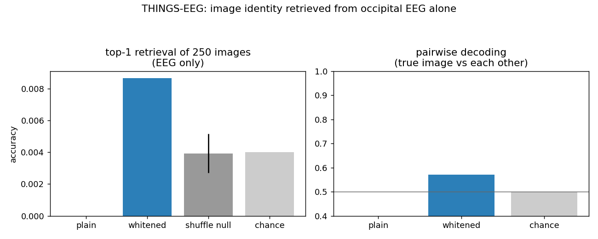
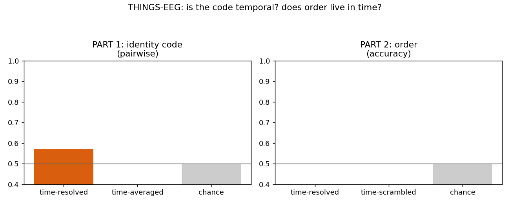

# Reading object identity out of occipital EEG — an honest probe

EDIT: My simplified understandg of this - we made a matrix out of visual cortex electrodes. Calculated 
what is present in all concepts - and what is present on specific concepts. This led to 57 % accuracy 
(above random). Which is impressive as the subject was watching a fast flickering stream of images. 
This is standard neuro science I guess. 

*PerceptionLab. Governing rule: do not hype, do not lie, just show.*

Two small scripts that ask one question on real human brain data:

> Can you recover **what a person was looking at** from their occipital EEG **alone** — with the image never shown to the reader — using only two operations: average the repeats of a stimulus into a template (**record**), and correlate a held-out trial against the templates (**read**)?

This is the empirical end of a larger theory project (a "mathematical holography" framework for cortical computation). These scripts test only the part that can be checked against data. Everything below is reported with its corrections and limits attached. The headline result is real but **modest**, and it is **not** evidence that "the brain is a hologram" — it is ordinary, replicable neural decodability, framed in the record/read language of the framework.

## Data

- **EEG:** OpenNeuro [`ds003825`](https://openneuro.org/datasets/ds003825) — THINGS-EEG, 50 subjects, 10 Hz rapid serial visual presentation (RSVP), 64-channel BrainVision, 1000 Hz. (Grootswagers, Zhou, Robinson, Hebart & Carlson, *Scientific Data* 2022.)
- **Images / labels:** the [THINGS](https://things-initiative.org/) database — 1,854 object concepts, 12 exemplar images each.
- Results below are **subject `sub-01`**, occipital/parieto-occipital channels `O1 Oz O2 PO7 PO3 POz PO4 PO8`, response window **50–300 ms** after stimulus onset.

## The two scripts

**`things_eeg_decode.py`** — identity readout.
Averages the repeats of each class into a neural template (record = superposition), then leave-one-trial-out correlates each held-out trial against every template and takes the argmax (read = projection). Scored against the 1/N chance and a label-shuffled null. Reports a plain cosine reader and a **whitened** (decorrelated) reader.

**`things_eeg_order.py`** — is the code temporal, and does presentation order live in time?
*Part 1* decodes identity from the time-resolved response (channels × timepoints) vs the time-**averaged** response (channels only). *Part 2* tries to recover the order of adjacent stimuli by sliding each class template across the window and comparing peak latency, with a **time-scramble control**.

Both files run a synthetic self-test if you pass no arguments, so you can confirm the logic before touching real data.

## Install & run

```
pip install mne pandas numpy scipy matplotlib

python things_eeg_decode.py \
  --eeg    ds003825/sub-01/eeg/sub-01_task-rsvp_eeg.vhdr \
  --events ds003825/sub-01/eeg/sub-01_task-rsvp_events.tsv \
  --label object --min-reps 12

python things_eeg_order.py \
  --eeg    ds003825/sub-01/eeg/sub-01_task-rsvp_eeg.vhdr \
  --events ds003825/sub-01/eeg/sub-01_task-rsvp_events.tsv \
  --label object --min-reps 12
```

`--label object` decodes at the **concept** level (1,854 concepts × 12 exemplars). See *Reproduction notes* for why you should pass it explicitly.

## Results (sub-01, concept level, 250 classes, 3000 trials)



| reader | top-1 | pairwise | note |
|---|---|---|---|
| chance | 0.0040 | 0.500 | 1/N and coin-flip |
| shuffle null | 0.0039 ± 0.0012 | — | labels permuted |
| **plain projection** | 0.000 | **0.077** | fails — *below* chance |
| **whitened projection** | **0.009** | **0.570** | ~2.3× chance, ~4σ over null |



| test | result | reading |
|---|---|---|
| Part 1 — time-resolved identity | pairwise **0.571** | the decodable signal is in the waveform |
| Part 1 — time-averaged identity | pairwise **0.212** | collapsing time destroys it (below chance = artifact) |
| Part 2 — order, time-resolved | **0.017** | degenerate readout — **not a result** (see below) |
| Part 2 — order, time-scrambled | 0.018 | — |

## What the numbers mean (the ledger)

**Established.** Concept identity is reliably present in the occipital field and can be pulled out by record-then-read: whitened pairwise **0.570**, top-1 ~2.3× chance, ~4σ above a shuffled null, on a single subject, replicated across two label columns and three runs. The image is **never** fed into the reader.

**The correction the data forced.** Plain correlation **fails** (pairwise 0.077, below chance): raw EEG is dominated by a large shared visual-evoked component that swamps cosine similarity. You only recover identity after **whitening** (decorrelating) the features. This is standard MVPA practice — and it cuts *against* a literal "diffusive medium is the reader" story, because diffusion *correlates* (smooths) whereas the working reader must *de*correlate. The honest picture: the medium blurs; the reader has to un-blur. (Lateral inhibition is a plausible biological un-blurrer — but that is a hypothesis we did **not** test here.)

**Part 1 is real but not special.** Time-resolved beats time-averaged, i.e. identity lives in the temporal waveform, not a static amplitude snapshot. True — but this is true of essentially *all* visual EEG decoding. It is consistent with "the code is temporal" and nothing stronger. The 0.212 baseline is *below* chance (the same shared-component artifact), so the size of the gap is inflated; the safe statement is just "collapsing time removes the decodable signal."

**Part 2 is a degenerate readout, not a finding.** At the concept level every template is nearly the same generic evoked response, and a 10 Hz window spans ~5 overlapping image responses, so the matched filter cannot localise one stimulus versus the next and the score collapses to ~0. The 0.017 says nothing about the brain. Moreover, even a *working* order readout would, on RSVP, only recover response **latency** (each item peaks at its onset) — "position = time," which is not a phase code and not specific to this framework. A non-trivial order code would have to live in oscillatory phase, and on this same dataset frontal theta is symmetric with no theta–gamma coupling, so there is no such structure to find. The order question is **not answerable non-trivially on this data**, and we stopped rather than keep tuning a readout toward a result we already knew would be trivial.

## Limitations (read before citing)

- **n = 1.** Not yet replicated across subjects.
- **Concept-level, not image-level.** This events file is the main RSVP task (every image shown once); the 200 validation images repeated 12× are not in it, so there is no clean image-level set here.
- **This is decodability, not "holography."** Nothing in these numbers distinguishes the framework from ordinary EEG multivariate decoding. The record/read framing is a *description*, not a proof of mechanism.
- Scalp EEG heavily smears phase and sums over millions of neurons; absence of a phase/order effect here does not rule it out at finer scales — it just isn't measurable in this signal.

## Reproduction notes

- **Pass `--label object`.** Auto-detection of the identity column is fragile: an early version of the picker latched onto `stimdur` (monitor-timing jitter in the microseconds, whose values coincidentally repeat 8–12×) and decoded *hardware timing*, which sits exactly at chance. The current picker skips continuous/jitter and structural columns, but the explicit `--label` is the reliable path.
- The scripts auto-detect whether the events' `onset` is in seconds, samples, or milliseconds (this file stores **samples**), and build epochs accordingly.
- Run with no arguments for the built-in synthetic self-test of each decoder's core.

## Where this leaves the framework

These scripts come out of a larger "mathematical holography in the brain" project. After running them, here is the honest standing of that framework — stated so the repo doesn't outrun the evidence.

- **What we reproduced is standard neuroscience.** Whitened nearest-template decoding is essentially regularized LDA / MVPA, and ~0.57 pairwise at 10 Hz RSVP sits on the established baseline (compare the dataset authors' own concept-decoding figure). That is the point: the result is bulletproof *because* it is boring. A pipeline that failed to reproduce the baseline would be worthless.
- **The framework's abstract operations survive — but only because they're generic.** "Record by superposition, read by projection" is real on brain data. It is also just associative memory / MVPA. Nothing distinctive there.
- **The distinctive physical claims did not survive.** The literal "a diffusive field is the reader" is contradicted: the working reader must *decorrelate* (whiten), which is the opposite of diffusion (which smooths/correlates). The distinctive **order/phase** claim — the one genuinely novel prediction — was not measurable on this data (and on this same dataset, frontal theta is symmetric with no theta–gamma coupling, so there is no phase structure to carry it).
- **Whitening is a fact about the analysis, not a proven brain mechanism.** All we showed is that *our decoder* needs to decorrelate. Lateral inhibition is a plausible biological un-blurrer, but it is a hypothesis with no support from these numbers. It stays in the "bet" column.

So the strong, literal brain-theory version of the framework took real damage here, and what's left standing is a re-description of known neuroscience. That forces a choice about what the project is:

1. **A literal theory of the brain** — then the next step is not more code; it is a paradigm that could actually expose a phase/order code (intracranial recording, or a task designed to surface sequence coding), because masked 10 Hz scalp EEG provably cannot.
2. **A computational architecture** — a way to *build* systems — then the in-silico results stand on their own as engineering (e.g. the field model's demonstration that temporal slots preserve an order a static sum loses), with biology cited as inspiration, not claimed as proof.

The trap to avoid is the middle: keeping grand brain-theory language while only the engineering survives. This repo deliberately claims decodability and nothing more.

## Citation

THINGS-EEG: Grootswagers T., Zhou I., Robinson A. K., Hebart M. N., Carlson T. A. (2022). *Human EEG recordings for 1,854 concepts presented in rapid serial visual presentation streams.* Scientific Data 9:3. Dataset: OpenNeuro ds003825. THINGS: Hebart et al., 2019.

---
*If a result here ever looks bigger than the number on the bar, trust the bar.*
